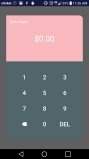

# Penny Dialog! #

>Currency dialog library.

## What this library is ##
>PennyDialog is a currency selection dialog with a material aesthetic that privileges you with visual customization, and your users with the ability to input monetary values, at their locale, in an elegant way.

## To use ##
Create the dialog like you would any other DialogFragment, and pass your implementation of the **CashChangeListener**, to **PennyDialog.newInstance()**, to receive callbacks when the user has set a monetary value. E.G.

     PennyDialog dialog = PennyDialog.newInstance(new PennyDialog.CashChangeListener() {
                   @Override
                   public void onPenniesChange(long pennies) {
                        Toast.makeText(SampleActivity.this, String.valueOf(pennies), Toast.LENGTH_SHORT).show();
                   }

                   @Override
                   public void onCashChange(String cashValue) {
                       //Toast.makeText(SampleActivity.this, cashValue, Toast.LENGTH_SHORT).show();
                   }
               }, bundle);
               
## To style ##
Extend PennyDialog's **PennyDialog** base theme, and override any attributes you want to customize. Then pass a reference to your customized theme in a **PennyDialog.newInstance(...)** method as a **Bundle**. Be sure to use **PennyDialog.STYLE_KEY** as the key for your style. E.G.

    
   
>Pass a reference to the style to PennyDialog   
   
    final Bundle styleBundle = new Bundle();
                 styleBundle.putInt(PennyDialog.STYLE_KEY, R.style.MyCustomPennyDialogTheme);
                 
    PennyDialog dialog = PennyDialog.newInstance(cashChangeListner, styleBundle);
    

## Attributes ##
     pennyValueCardColor - Color of the card with the monetary value
     pennyNumbersCardColor - Color of card with the input numbers
     pennyNumbersTextColor - Color of the input numbers
     pennyValueTextColor" - Color of the monetary value EditText
     pennyTitleTextColor - Color of The title
     pennyTitleText - Text for the title
     pennyTopLeftRadius - radius to round the top left corner
     pennyTopRightRadius - radius to round the top right corner
     pennyBottomLeftRadius - radius to round the bottom left corner
     pennyBottomRightRadius - radius to round the bottom right corner

     pennyFabBackgroundColor - Color for the background of the FloatingActionButton
     pennyFabSource - Src drawable for the FloatingActionButton 
    
    
    
    
    
